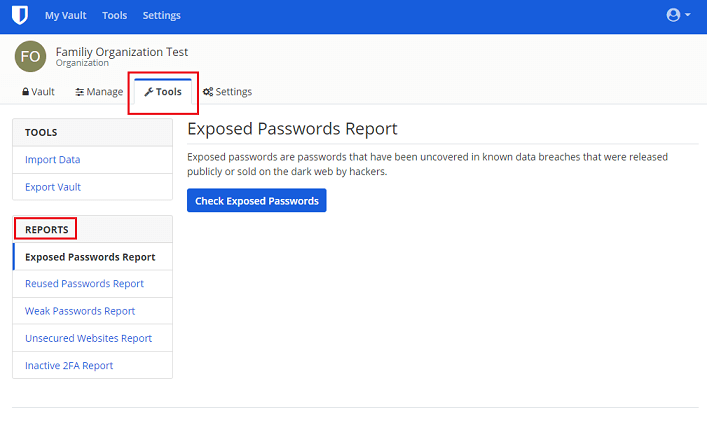

Bitwarden users with a premium membership can access a variety of reporting tools to evaluate the overall health of their personal Bitwarden vault following these steps:

1. Log in to the web vault at <https://vault.bitwarden.com>.
2. Click **Tools** in the top navigation bar.
3. Locate the **Reports** section.
4. Select the report needed.

Paid organization plans can also access these reports to analyze the items contained in the organizational vault:

1. Log in to the web vault at <https://vault.bitwarden.com>.
2. Click **Settings** in the top navigation bar.
3. Click **Organizations** in the top navigation bar.
4. Locate your Organization and click on it.
5. Click **Tools** in the Organization’s navigation bar.
    
6. Locate the **Reports** section.
7. Select the report needed.

### Available reports in the Bitwarden Vault

**Exposed Passwords Report**

These are passwords that have been uncovered in known data breaches that were released publicly or sold on the dark web.

The report uses a trusted web service to search the first 5 digits of the hash of all your passwords in a database of known leaked passwords. The returned matching list of hashes is then locally compared with the full hash of your passwords. That comparison is only done locally to preserve your [k-anonymity](https://en.wikipedia.org/wiki/K-anonymity){:target="_blank"}.

But why do we use only the first 5 digits of the hash of your passwords? If the report was performed with your actual passwords, it doesn't matter if those were exposed or not, you would be voluntarily leaking it to the service.

And even tough this report’s result may not mean your individual account has been compromised, just that you are using a password that has been found in these databases of exposed passwords, you should avoid using leaked and non-unique passwords.

**Reused Passwords Report**

If a service that you use is compromised, reusing the same password elsewhere can allow hackers to easily gain access to more of your online accounts. You should use a unique password for every account or service. The Reused Passwords Report helps you easily identify these offending passwords.

**Weak Passwords Report**

Weak passwords can easily be guessed by hackers and automated tools that are used to crack passwords. Use the Weak Passwords Report to isolate these passwords quickly. The Bitwarden password generator can help you create stronger passwords.

**Unsecured Websites Report**

Using unsecured websites with the http:// scheme can be dangerous. If the website allows, you should always access it using the https:// scheme so that your connection is encrypted.

**Inactive 2FA Report**

Two-factor authentication (2FA) is an important security setting that helps secure your accounts. If the website offers it, you should always enable two-factor authentication. The Inactive 2FA Report locates items in your Bitwarden vault where you have not stored a TOTP authenticator key and then cross-references it with data from [https://twofactorauth.org/](https://twofactorauth.org/){:target="_blank"}.

**Data Breach Report (Individual Vaults Only)**

A “breach” is an incident where a site’s data has been illegally accessed by hackers and then released publicly. The Data Breach Report allows you to review the types of data that were compromised in these breaches (email addresses, passwords, credit cards, etc.) and take appropriate action, such as changing passwords.


If you are self-hosting in order to run the **Data Breach** report in your instance, you will need to buy an HIBP subscription key that will authorize you to make calls to the API. You can find how to purchase this key [here](https://haveibeenpwned.com/API/Key){:target="_blank"}.

Once you have the key you will need to go to your `./bwdata/env/golbal.override.env` file, edit it and REPLACE the placeholders values for the API key:

```
globalSettings__hibpApiKey=REPLACE
```

