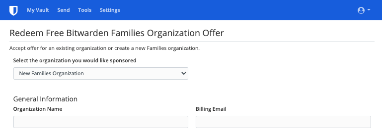
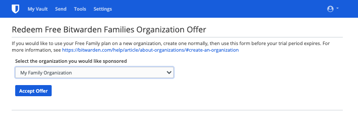

Members of [Enterprise Organizations]({{site.baseurl}}/article/about-organizations/#types-of-organizations) are offered a **free Families Organization** sponsorship that can be applied to a new or pre-existing Families Organization and redeemed directly from the Web Vault.

Using a **Families Organization**, you can securely share Vault data between yourself and up to 5 friends or family members. Families Organizations include premium Bitwarden features for all 6 users, including [advanced Two-step Login methods]({{site.baseurl}}/article/setup-two-step-login), [encrypted file attachments]({{site.baseurl}}/article/attachments), [Emergency Access]({{site.baseurl}}/article/emergency-access/), and [more]({{site.baseurl}}/article/about-bitwarden-plans/#compare-the-plans).

## Redeem your Sponsorship

To redeem your sponsorship:

1. Log in to the Bitwarden account attached to the sponsoring Organization.
2. Navigate to **Settings** &rarr; **Free Bitwarden Families**:

   
3. On this screen, provide a **personal email** you want to redeem the sponsorship with and select **Redeem**:

   If you already have a separate personal Bitwarden account, use the email address attached to that account. If you don't already have a separate personal Bitwarden account, you'll need to create one with the personal email you enter here.  **Do not** use the email address or Bitwarden account attached to the sponsoring Organization.
4. In your inbox, you'll get an email from Bitwarden inviting you to accept the sponsorship:

   

   Select **Accept Sponsorship** to continue.
5. If there is a Bitwarden account associated with the provided **personal email**, log in. If there is not an account associated with the personal email, you'll be directed to the Create Account screen.
6. Once you've logged in, you'll be directed to a screen where you can finish redeeming your sponsorship for a **New Families Organization** or an **Existing Families Organization**:

   <ul class="nav nav-tabs" id="myTab" role="tablist">
     <li class="nav-item" role="presentation">
       <a class="nav-link active" id="mobtab" data-target="#mobile" role="tab" aria-controls="mobile" aria-selected="false">New Families Organization</a>
     </li>
     <li class="nav-item" role="presentation">
       <a class="nav-link" id="desktab" data-target="#desktop" role="tab" aria-controls="desktop" aria-selected="false">Existing Families Organization</a>
     </li>
   </ul>
   

     

       
      
Select <b>New Families Organization</b> from the dropdown:

      
       
       
      
Fill in the following information:

      <ul>
        <li>An <b>Organization Name</b>.</li>
        <li>A <b>Billing Email</b>.</li>
        <li>Whether you want to add <b>Additional Storage (GB)</b>. Your sponsorship covers 1 GB free.</li>
        <li><b>Payment Information</b>.</li>
      </ul>
       
      
 You won't have to make any payments for the Families Organization as long as you are an active member of the sponsoring Organization, unless you add <b>Additional Storage</b>. When you're done filling in your information, select <b>Submit</b>.

     

     

       
      
Select the Organization from the dropdown and select <b>Accept Offer</b>:

      
       
       
      
When you accept the offer, your old subscription will be replaced by the Enterprise Sponsorship. You won't have to make any payments for the Families Organization as long as you are an active member of the sponsoring Organization.

     

   


**Congratulations!** If you're new to using Bitwarden Families Organizations, we recommend checking out [this article]({{site.baseurl}}/article/getting-started-organizations/#get-to-know-your-organization) to learn the basics.

